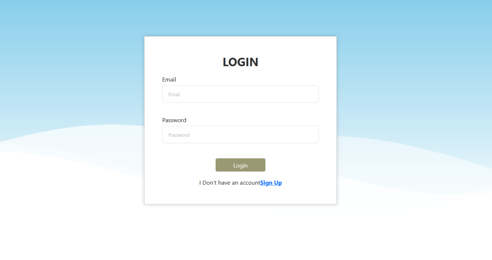
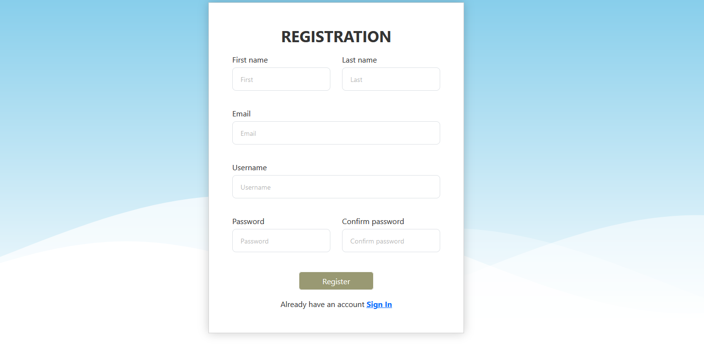
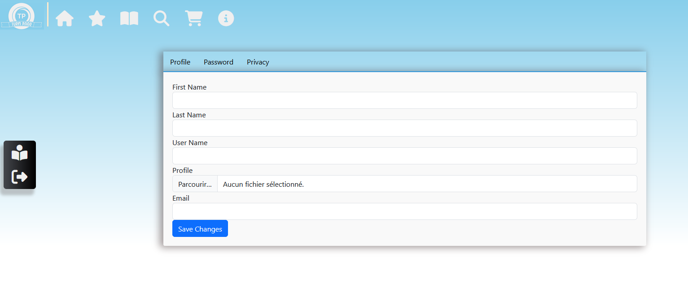

# Présentation de l'Application de Gestion de Livres

L'application de gestion de livres est une plateforme moderne conçue pour offrir une expérience fluide aux utilisateurs souhaitant explorer, gérer et interagir avec une vaste bibliothèque numérique. Elle repose sur une architecture robuste et modulaire :

- **Back-end** : Développé avec .NET Core, garantissant des performances élevées, une sécurité renforcée, et une extensibilité facile pour intégrer de nouvelles fonctionnalités.
- **Front-end** : Créé avec Angular, fournissant une interface utilisateur réactive et dynamique, adaptée à tous les types de dispositifs.
- **Base de données** : SQL Server est utilisé pour stocker et organiser efficacement les données des utilisateurs, des livres, des transactions et des interactions.

## Illustrations de l'Application

### Page d'introduction

### Page de connexion

### Page d'inscription

### Paramètres du compte

### Page d'accueil

### Choix d'un livre

### Détails du livre

### Lire un livre

### Afficher le livre PDF

### Commentaires sur un livre

